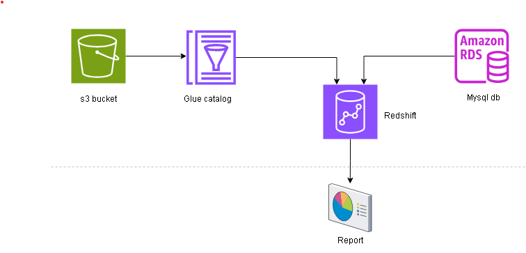

# Redshift Data Warehouse Solution for Retail Data Analytics

## Overview

- In this project I've built redshift data warehouse solution for retail data analytics by using various features of aws redshift such as spectrum, federated queries,...
- The retail data has 6 different entities namely categories, departments, products, orders, order_items an customers.
- Categories and departments are the smallest possible entities, so I decided to create redshift managed tables and loaded the data into the tables using COPY commands.
- Orders and order_items are big entities, so data stays in s3 and glue meta data is used for Metadata to procces in spectrum layer of redshift.
- Products and customers are from rds Mysql db. Used Federated queries to process them in redshift.

- I have designed this as an end to end solution as below:
  - creating redshift cluster, creating tables 
  - creating glue database and tables with data in s3
  - creating Mysql db in rds and creating tables and inserting data into the tables
  - created external schemas for spectrum and federated queries in redshift
  - and finally validated the schemas by running a join query
  - on top of this a BI tool can be plugged in for data analysis 

## Setup
To set up and deploy this solution, follow these steps:

1. **Clone this repository:**
    ```bash
    git clone https://github.com/Lashmanbala/aws_redshift
    ```
2. **Configure your AWS:**

   Configure your AWS credentials on your host machine to authenticate with AWS.
   
   Create required credentials in secrets manager for redshift cluster, redshift database and for mysql database.

   Create an s3 bucket and upload the files

3. **Create .env file :**

   And create a .env file like sample.env file with your values
   
4. **Install Required Packages:**
    ```bash
   pip3 install -t requirements.txt
   ```
5. **Run The Script to deploy the resources:**
   ```bash
   python3 app.py
   ```
   Wait for all the resources to be created
   
6. **Run the script for queries:**
   ```bash
   python3 queries.py
   ```
   The validation queries will return results to the local terminal

## Contact
For any questions, issues, or suggestions, please feel free to contact the project maintainer:

GitHub: [Lashmanbala](https://github.com/Lashmanbala)

LinkedIn: [Lashmanbala](https://www.linkedin.com/in/lashmanbala/)
